# Chromium 无 CSS 字体选择 - Mermaid 流程图

## 完整的 CSS 到字体选择管道

```mermaid
graph TD
    A["HTML 解析<br/>(无 font-family CSS)"] --> B["StyleResolver::ResolveStyle()"]
    
    B --> C["━━━━━ CSS 应用阶段 ━━━━━<br/>StyleCascade::Apply()"]
    
    C --> D{是否存在<br/>font-family<br/>CSS 值?}
    
    D -->|✓ 有| E["StyleBuilder::ApplyProperty<br/>(CSSPropertyID::kFontFamily, ...)<br/>style_builder.cc"]
    D -->|✗ 无| F["FontDescription 保留初始值<br/>(kNoFamily)<br/>font_description.cc:88-104"]
    
    E --> G["StyleBuilderConverter::<br/>ConvertFontFamily()<br/>style_builder_converter.cc:510-590"]
    
    G --> H["ConvertFontFamilyName()<br/>处理单个 CSSValue"]
    
    H --> I["CSSValue → FontDescription::<br/>FamilyDescription<br/>(例如: serif → kSerifFamily)"]
    
    F --> J["━━━━━ UpdateFont 阶段 ━━━━━<br/>StyleResolverState::UpdateFont()<br/>style_resolver_state.cc:442"]
    I --> J
    
    J --> K["FontBuilder::CreateFont()<br/>font_builder.cc:653-700"]
    
    K --> L{FontDescription<br/>generic_family<br/>== kNoFamily?}
    
    L -->|✓ 是| M["InitialGenericFamily()<br/>返回 kStandardFamily<br/>font_builder.h:138"]
    L -->|✗ 否| N["使用 CSS 指定的值<br/>(例: kSerifFamily)"]
    
    M --> O["FontDescription<br/>被设为初始值"]
    N --> O
    
    O --> P["FontSelector* font_selector<br/>= ComputeFontSelector(builder)<br/>font_builder.cc:680"]
    
    P --> Q["创建 Font 对象<br/>MakeGarbageCollected&lt;Font&gt;<br/>(description, font_selector)"]
    
    Q --> R["Font 对象包含:<br/>├─ FontDescription<br/>├─ CSSFontSelector ★<br/>└─ FontFallbackList (未初始化)"]
    
    R --> S["← 此时结束 Style Calculation"]
    
    S --> T["━━━━━ 延迟阶段 ━━━━━<br/>(Paint/Layout 时触发)"]
    
    T --> U["Font::PrimaryFont()<br/>被调用"]
    
    U --> V{"FontFallbackList<br/>已初始化?"}
    
    V -->|✗ 否| W["FontFallbackList::Create()<br/>font_fallback_list.cc"]
    V -->|✓ 是| X["返回已缓存字体"]
    
    W --> Y["FontFallbackList::GetFontData()"]
    
    Y --> Z["CSSFontSelector::GetFontData()<br/>css_font_selector.cc"]
    
    Z --> AA{查询顺序}
    
    AA -->|1️⃣ 先查| AB["FontFaceCache::Get()<br/>(@font-face 缓存)"]
    AA -->|2️⃣ 再查| AC["FontCache::GetFontData()<br/>(系统字体)"]
    
    AB -->|✓ 找到| AD["返回 Web 字体<br/>SimpleFontData"]
    AB -->|✗ 未找到| AC
    
    AC -->|Linux| AE["GenericFontFamilySettings<br/>返回 'DejaVu Sans'"]
    AC -->|Android| AF["fonts.xml 查询<br/>SkFontMgr_android.cpp"]
    
    AF --> AG["Skia 解析 fonts.xml<br/>standard → sans-serif → Roboto"]
    
    AE --> AH["加载字体文件<br/>(.ttf 到内存)"]
    AG --> AH
    
    AH --> AI["创建 SimpleFontData<br/>(含字形数据指针)"]
    
    AD --> AJ["HarfBuzz Shaping<br/>shaping/harfbuzz_shaper.cc<br/>字符 → 字形 ID"]
    AI --> AJ
    
    AJ --> AK["Skia 光栅化<br/>graphics_context.cc<br/>字形 → 像素"]
    
    AK --> AL["屏幕显示"]
    
    X --> AL
    
    style A fill:#e1f5ff
    style C fill:#fff3e0
    style J fill:#f3e5f5
    style T fill:#e8f5e9
    style AL fill:#c8e6c9
    
    classDef decision fill:#ffe0b2,stroke:#ff9800,stroke-width:2px
    classDef function fill:#e3f2fd,stroke:#2196f3,stroke-width:2px
    classDef result fill:#f1f8e9,stroke:#8bc34a,stroke-width:2px
    
    class D,L,V,AA decision
    class E,G,K,P,U,Z function
    class AL,AD,AI result
```



---

## 流程图说明

### 🟦 色彩编码

| 颜色 | 含义 | 例子 |
|------|------|------|
| 蓝色 | 函数/方法调用 | `ConvertFontFamily()`, `CreateFont()` |
| 橙色 | 决策点 | 是否有 CSS? 是否 kNoFamily? |
| 绿色 | 结果/输出 | SimpleFontData, 屏幕显示 |

---

### 📍 关键分支

#### 分支 1: CSS 存在 vs 不存在

```
CSS 存在: font-family: serif
  → ConvertFontFamily() 转换
  → FontDescription.generic_family = kSerifFamily
  
CSS 不存在: (无 style 属性)
  → FontDescription 保留 kNoFamily
  → 后续 InitialGenericFamily() 覆盖为 kStandardFamily
```

#### 分支 2: 初始值应用

```
若 generic_family == kNoFamily
  → FontBuilder::InitialGenericFamily() 返回 kStandardFamily
  → 设置为 "标准"/"无衬线" 族
```

#### 分支 3: 系统差异

```
Linux:
  → GenericFontFamilySettings 表有内容
  → 返回预设字体名 (如 "DejaVu Sans")
  
Android:
  → GenericFontFamilySettings 表为空
  → 触发 SkFontMgr 解析 fonts.xml
  → "standard" → "sans-serif" → "Roboto"
```

---

## 时间维度

### Style Calculation 阶段 (同步)
1. CSS 解析
2. FontDescription 创建/更新
3. Font 对象创建
4. CSSFontSelector 赋予
5. ⏸️ **暂停** - 尚未加载字体

### Paint/Layout 阶段 (延迟)
6. Font::PrimaryFont() 被调用
7. FontFallbackList 初始化
8. 字体查询 (@font-face → 系统)
9. 字体加载 (.ttf 文件)
10. HarfBuzz Shaping
11. Skia 光栅化
12. 屏幕显示

---

## 代码文件导航

### CSS 解析阶段
- **style_builder_converter.cc:470-590** - `ConvertFontFamily()` 和 `ConvertFontFamilyName()`
- **style_builder_converter.h** - 转换器声明

### Font 创建阶段
- **font_builder.cc:653-700** - `FontBuilder::CreateFont()`
- **font_builder.h:138** - `InitialGenericFamily()`
- **font.h** - Font 类声明

### 延迟匹配阶段
- **font_fallback_list.cc** - `FontFallbackList::Create()`, `PrimaryFont()`, `GetFontData()`
- **css_font_selector.cc** - `CSSFontSelector::GetFontData()`
- **font_cache.cc** - `FontCache::GetFontData()`
- **font_cache_android.cc** - Android 特定逻辑

### Android 特定
- **third_party/skia/src/ports/SkFontMgr_android.cpp** - fonts.xml 解析

---

## 性能分析

| 阶段 | 发生时机 | 成本 | 阻塞? |
|------|---------|------|-------|
| CSS 解析 → FontDescription | Style Calc | 低 | 否 |
| Font 对象创建 | Style Calc | 低 | 否 |
| CSSFontSelector 赋予 | Style Calc | 低 | 否 |
| **FontFallbackList 初始化** | Paint | **中** | ✓ 是 |
| **fonts.xml 解析** | Paint (Android) | **中-高** | ✓ 是 |
| **TTF 加载** | Paint | **高** | ✓ 是 |
| HarfBuzz Shaping | Paint | 中 | 是 |
| Skia 光栅化 | Paint | 中 | 是 |

**关键**: 延迟到 Paint 阶段可以避免在 Style Calculation 中阻塞!

---

## 快速问答

### Q: 为什么 FontFallbackList 没有在 Style Calc 时初始化?
**A**: 为了性能!不是所有元素都会被绘制到屏幕上,延迟初始化避免不必要的字体加载。

### Q: CSSFontSelector 的作用是什么?
**A**: 它是 Font 对象与字体数据库的桥梁,知道有哪些 @font-face 声明和系统字体可用。

### Q: 无 CSS 时为什么要经过 InitialGenericFamily()?
**A**: 为了确保始终有一个有效的通用族值,避免空的 family 导致渲染失败。

### Q: Android 和 Linux 的差异在哪里?
**A**: 映射表内容不同 - Linux 有预设,Android 依赖 SkFontMgr 解析系统 fonts.xml。

---

## 参考资源

- [NO_CSS_FONT_SELECTION_DETAIL.md](NO_CSS_FONT_SELECTION_DETAIL.md) - 详细文本说明
- [CHROMIUM_FONT_SELECTION_QUICK_REFERENCE.md](CHROMIUM_FONT_SELECTION_QUICK_REFERENCE.md) - 快速参考卡片
- [DOCUMENTATION_UPDATE_SUMMARY.md](DOCUMENTATION_UPDATE_SUMMARY.md) - 改进总结

